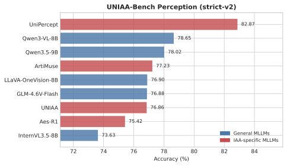
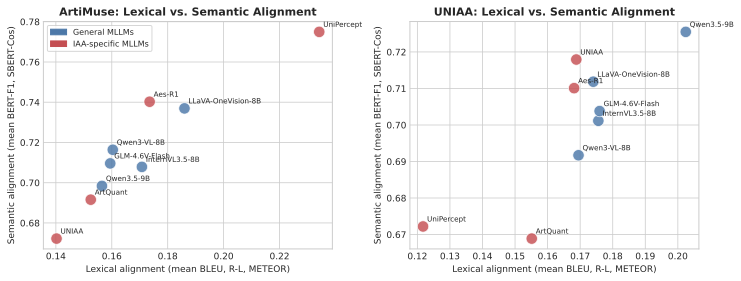
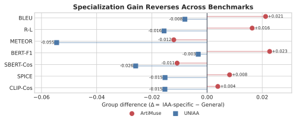

# Aesthetic Evaluation

[](https://github.com/An-Moon/Aesthetic-evaluation/actions/workflows/ci.yml)
[](https://github.com/An-Moon/Aesthetic-evaluation/releases/tag/v0.1.0)
[](LICENSE)
[](pyproject.toml)

A reproducible, fail-loud framework for evaluating multimodal large language
models on image-aesthetics tasks. It separates inference from offline scoring,
uses fixed cross-model protocols, validates complete sample coverage, and keeps
enough provenance to audit every released aggregate result.

The current release evaluates:

| Task | Benchmark | Public protocol | Evaluation size |
|---|---|---|---:|
| Dimension-conditioned description | ArtiMuse-10K | 0-shot and 16-shot text-only | 7,984 |
| Aesthetic description | UNIAA-Bench | fixed-first 1-shot text-only | 500 |
| Multiple-choice aesthetic perception | UNIAA-Bench | official-v1 prompt + strict-v2 parser | 5,354 |

An independent score-evaluation toolbox is included as **experimental**. The
release does not claim AVA or TAD headline results.

## Why this repository

- One CLI for inference, resume, offline metrics, and progress evaluation.
- Native preprocessing and chat templates for each supported checkpoint.
- Deterministic greedy decoding for the released cross-model protocols.
- Strict checks for missing images, duplicate IDs, empty predictions, skipped
  samples, configuration drift, and ambiguous multiple-choice answers.
- No fallback to substitute weights, guessed answers, empty strings, or `0.0`
  scores when a component fails.
- Aggregate-only public results with dataset, checkpoint, config, parser,
  prediction, and metric hashes.

## Results at a glance

The figures below are generated from the aggregate artifacts in
[`results/v0.1.0`](results/v0.1.0). Full predictions and benchmark references
are intentionally not distributed.

### UNIAA perception

<p align="center">
  
</p>

UniPercept obtains the highest released QA accuracy (82.87%). The result also
shows that aesthetic specialization alone does not guarantee stronger
multiple-choice perception performance: several general MLLMs remain
competitive with specialized checkpoints.

### Description: lexical versus semantic alignment

<p align="center">
  
</p>

Model rankings change across ArtiMuse and UNIAA. The released metrics therefore
support a cross-benchmark conclusion, rather than one universal ranking of
aesthetic description ability.

### Cross-dataset specialization difference

<p align="center">
  
</p>

The README presents only the main figures. Small machine-readable CSV/JSON
files remain in the repository because they are required to verify sample
counts, hashes, subgroup values, and figure generation. Publication PDFs,
LaTeX tables, and the same aggregates are also attached to the
[`v0.1.0` release](https://github.com/An-Moon/Aesthetic-evaluation/releases/tag/v0.1.0).

## Model support

| Model family | Released status |
|---|---|
| InternVL3.5-8B, GLM-4.6V-Flash, Qwen3.5-9B, Qwen3-VL-8B, LLaVA-OneVision-8B | validated |
| UNIAA, UniPercept, Aes-R1 | validated |
| ArtiMuse | QA validated; ArtiMuse Description is `in_domain_only` |
| ArtQuant | Description retained with a template-output caveat; QA not run |
| Q-SiT, AesExpert | adapters are public, but Description outputs are `invalid_for_protocol` |

See [`docs/MODELS.md`](docs/MODELS.md) and the machine-readable
[`model_matrix.csv`](results/v0.1.0/model_matrix.csv) for task-specific status,
checkpoint revisions, configuration hashes, and limitations.

## Quick start

### 1. Clone and install the framework

Python 3.10 is recommended for model inference. Python 3.10 and 3.11 are both
used by the CPU test suite.

```bash
git clone https://github.com/An-Moon/Aesthetic-evaluation.git
cd Aesthetic-evaluation

python -m venv .venv
source .venv/bin/activate
python -m pip install --upgrade pip
python -m pip install -e '.[dev]'

python run.py --help
python -m unittest discover -s tests -v
```

This installs the framework and CPU validation dependencies. GPU model stacks
are installed separately because the evaluated checkpoints require mutually
incompatible Transformers versions.

### 2. Configure local paths

```bash
cp .env.example .env
# Edit .env so every path points to an existing local resource.

set -a
source .env
set +a
```

The repository does not load `.env` implicitly. It must be sourced in every new
shell, or the variables must be exported by another environment manager.

Required variables:

```text
AESTHETIC_DATA_ROOT
AESTHETIC_MODEL_ROOT
AESTHETIC_OUTPUT_ROOT
AESTHETIC_METRIC_MODEL_ROOT
AESTHETIC_JAVA
```

Keep `AESTHETIC_OUTPUT_ROOT` outside the Git checkout when possible. Missing or
unresolved variables are fatal rather than silently replaced.

### 3. Download datasets and checkpoints

Datasets and model weights are not redistributed.

- [ArtiMuse-10K](https://huggingface.co/datasets/Thunderbolt215215/ArtiMuse-10K)
- [UNIAA official repository](https://github.com/KlingAIResearch/Uniaa)

Expected dataset layout:

```text
$AESTHETIC_DATA_ROOT/
├── Artimuse/
│   ├── images/
│   ├── score/test.json
│   └── text/{train.jsonl,test.jsonl}
└── UNIAA/A_UNIAA_Bench/
    ├── description/
    └── perception/
```

Model directories must match the `model_path` in the selected YAML under
[`configs/models/examples`](configs/models/examples). Checkpoints are always
loaded locally; the framework never substitutes a downloaded model at runtime.

### 4. Create a model-specific environment

The exact release environments are recorded under
[`configs/environments`](configs/environments). They are version manifests,
not directly installable requirements, because the appropriate PyTorch build
depends on the host CUDA driver.

For example, the Qwen/InternVL/GLM release environment used Python 3.10 with
PyTorch 2.11.0, torchvision 0.26.0, Transformers 5.5.4, Accelerate 1.13.0,
PEFT 0.18.1, and timm 1.0.26:

```bash
conda create -n aesthetic-qwen python=3.10 -y
conda activate aesthetic-qwen

# Install the PyTorch 2.11.0 build appropriate for your CUDA driver first.
python -m pip install torchvision==0.26.0
python -m pip install \
  transformers==5.5.4 accelerate==1.13.0 peft==0.18.1 timm==1.0.26
python -m pip install -e .
```

Use the recorded `llava37`, `llava_onevision`, or `aes_r1` environment for
those model families. Do not upgrade one shared environment until all target
adapters import successfully; separate environments are the reproducible path.

### 5. Prepare deterministic UNIAA splits

```bash
python scripts/prepare_uniaa_description_1shot_v1.py \
  --source-root "$AESTHETIC_DATA_ROOT/UNIAA/A_UNIAA_Bench/description" \
  --output-dir "$AESTHETIC_DATA_ROOT/prepared/uniaa_description_1shot" \
  --context-output "$UNIAA_1SHOT_CONTEXT_FILE"

python scripts/prepare_uniaa_perception_official_v1.py \
  --source-root "$AESTHETIC_DATA_ROOT/UNIAA/A_UNIAA_Bench/perception" \
  --output-dir "$AESTHETIC_DATA_ROOT/prepared/uniaa_perception"
```

For ArtiMuse 16-shot, rebuild the leakage-controlled examples locally:

```bash
python scripts/audit_and_select_artimuse_context.py \
  --root "$AESTHETIC_DATA_ROOT/Artimuse" \
  --output "$ARTIMUSE_CONTEXT_FILE" \
  --audit-output "$AESTHETIC_OUTPUT_ROOT/artimuse_context_audit.json"
```

Preparation scripts validate the expected source count and image availability.
The fixed-first UNIAA Description builder also refuses to overwrite an existing
protocol artifact when its bytes have drifted.

### 6. Run a smoke test

The following command runs the first four prepared UNIAA QA rows with Qwen3-VL:

```bash
CUDA_VISIBLE_DEVICES=0 python run.py infer \
  --base-config configs/protocols/uniaa_perception_official_v1.yaml \
  --model-config configs/models/examples/qwen3_vl_8b.yaml \
  --sample-limit 4 \
  --output-root "$AESTHETIC_OUTPUT_ROOT/smoke"
```

Inspect the generated `run_meta.json` and confirm that four non-empty rows were
written to `predictions.jsonl` before starting a full run.

### 7. Run a released protocol

```bash
# UNIAA perception, 5,354 questions
CUDA_VISIBLE_DEVICES=0 bash scripts/run_uniaa_perception.sh \
  configs/models/examples/qwen3_vl_8b.yaml

# UNIAA Description, fixed-first 1-shot, 500 images
CUDA_VISIBLE_DEVICES=0 bash scripts/run_uniaa_description.sh \
  configs/models/examples/qwen3_vl_8b.yaml

# ArtiMuse Description, 0-shot or 16-shot
CUDA_VISIBLE_DEVICES=0 bash scripts/run_artimuse_description.sh \
  configs/models/examples/qwen3_vl_8b.yaml 0shot
```

To resume, pass the original output directory as the final launcher argument.
Resume validates existing IDs and rejects duplicates or rows from another
dataset.

## Evaluation

### UNIAA perception

```bash
python scripts/eval_uniaa_perception_strict.py \
  --pred-file "$AESTHETIC_OUTPUT_ROOT/<run>/predictions.jsonl" \
  --dataset-file "$AESTHETIC_DATA_ROOT/prepared/uniaa_perception/test_5354.jsonl" \
  --output-file "$AESTHETIC_OUTPUT_ROOT/<run>/accuracy_strict_v2.json"
```

The parser accepts only an unambiguous option label or uniquely normalized
option text. Invalid answers remain invalid and count against the full 5,354-row
denominator.

### Description metrics

Use a dedicated metric environment; its dependencies need not match the model
inference environment:

```bash
conda create -n aesthetic-metrics python=3.10 -y
conda activate aesthetic-metrics
python -m pip install -e '.[metrics]'
```

Download the exact local BERTScore, SBERT, and CLIP checkpoints identified in
the metric YAML, configure Java 8 for SPICE, and then run:

```bash
python run.py eval \
  --pred-file "$AESTHETIC_OUTPUT_ROOT/<run>/predictions.jsonl" \
  --output-file "$AESTHETIC_OUTPUT_ROOT/<run>/metrics_v2.json" \
  --metrics-config configs/metrics/artimuse_description_v2.yaml \
  --by-dimension
```

The released metrics are BLEU, ROUGE-L, METEOR, BERT-F1, SBERT-Cos, SPICE, and
CLIP-Cos. `CLIP-Cos` is normalized CLIP image-text cosine, not the scaled metric
commonly called CLIPScore. Metric loading, Java parsing, and model errors stop
the evaluation; they are never converted to `0.0`.

## Output contract

Each inference run creates:

```text
<output-root>/<model>_<task>_<timestamp>/
├── predictions.jsonl
└── run_meta.json
```

`predictions.jsonl` contains sample ID, resolved image, complete prompt,
prediction, reference, dimension, model, task, and timestamp. Treat it as a
private research artifact: it may contain benchmark reference text and local
paths and must not be committed.

`run_meta.json` records the resolved protocol/model configuration, dataset
metadata, context hash, runtime versions, sample counts, and timing.

## Repository layout

```text
run.py                              # infer / eval / eval-progress CLI
src/aesthetic_eval/                 # runtime, adapters, data, metrics
configs/protocols/                  # frozen task protocols
configs/models/examples/            # portable local-checkpoint configs
configs/metrics/                    # strict metric protocols
configs/environments/               # release environment manifests
scripts/                            # preparation, launch, evaluation, export
tests/                              # CPU and strict-parser tests
docs/                               # protocol and comparability details
results/v0.1.0/                     # aggregate-only public evidence
aesthetic_eval_score_framework/     # experimental scoring toolbox
```

## Reproducibility boundary

- ArtiMuse results require 7,984/7,984 rows.
- UNIAA Description requires 500/500 rows after removing the fixed first
  text-only example.
- UNIAA perception requires 5,354/5,354 rows.
- Decoding is greedy with `do_sample: false` and `num_beams: 1`.
- The released Description protocol is a unified cross-model comparison, not a
  direct reproduction of the UNIAA paper's stochastic Description setting.
- Q-SiT and AesExpert are excluded from primary Description results because
  they failed predefined output-behavior checks.
- ArtiMuse is excluded from the primary ArtiMuse group comparison because it is
  trained in-domain.

See [`docs/RESULTS.md`](docs/RESULTS.md),
[`docs/ARTIMUSE_PROTOCOL.md`](docs/ARTIMUSE_PROTOCOL.md),
[`docs/UNIAA_DESCRIPTION_PROTOCOL.md`](docs/UNIAA_DESCRIPTION_PROTOCOL.md), and
[`docs/UNIAA_PERCEPTION_PROTOCOL.md`](docs/UNIAA_PERCEPTION_PROTOCOL.md).

## License and citation

Original repository code is licensed under Apache-2.0. External checkpoints,
datasets, and optional upstream repositories retain their own terms; see
[`NOTICE`](NOTICE) and [`docs/DATA.md`](docs/DATA.md).

Formal paper metadata is still pending, so the repository intentionally does
not include `CITATION.cff`. Use the GitHub repository and release URL until the
paper citation is published.
